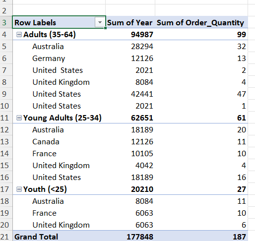
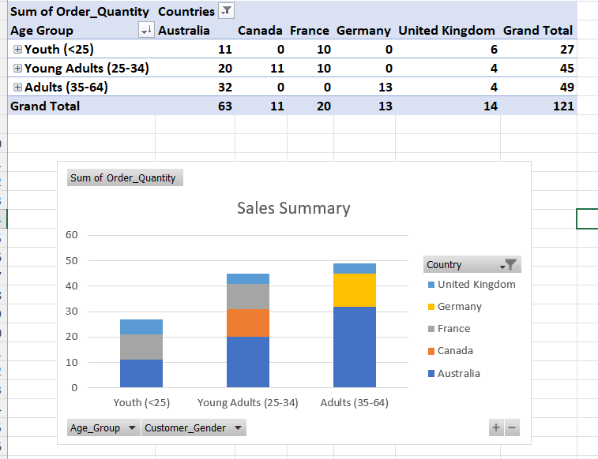
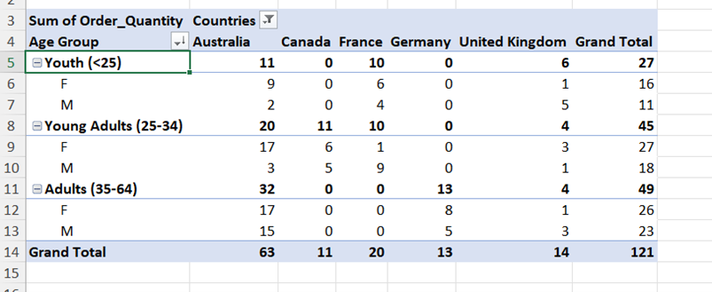
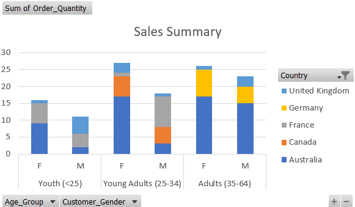

# Global Bike Sales Analysis 🚲

## 📌 Project Overview
This project involves a comprehensive analysis of retail bike sales data to identify key performance drivers, customer demographics, and regional trends. Using **Microsoft Excel**, I transformed raw transactional data into actionable business insights via Pivot Tables and dynamic visualizations.

## 📊 Key Business Questions Addressed
* **Geographic Analysis:** Which countries dominate the market in terms of order volume?
* **Demographic Profiling:** How do age groups and gender influence purchasing habits?
* **Profitability:** Which segments represent the highest growth potential for the business?

---

## 🛠 Analysis Breakdown

### 1. Market Segmentation by Age & Region
Analyzing the distribution of orders across different age brackets (Adults, Young Adults, Youth) to understand market maturity in various countries.

| Data Summary | Visual Representation |
| :--- | :--- |
|  |  |

**Insight:** The **Adult (35-64)** demographic represents the largest market share, specifically within the United States.

### 2. Gender-Based Purchasing Trends
A deep dive into gender-specific behavior across regions to assist in targeted marketing strategies.

| Data Summary | Visual Representation |
| :--- | :--- |
|  |  |

**Insight:** Analyzing the balance between male and female customers helps identify if product lines need to be adjusted for regional gender preferences.

---

## 🚀 Key Technical Skills Applied
* **Data Cleaning:** Preparing raw data for analysis.
* **Pivot Tables:** Aggregating complex datasets into readable summaries.
* **Data Visualization:** Crafting stacked column charts to simplify demographic comparisons.
* **Business Logic:** Using data to answer specific commercial objectives.

